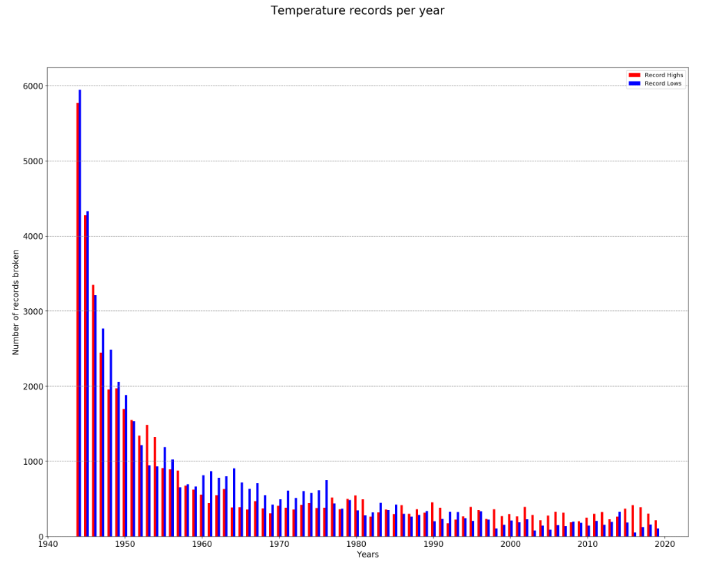

# High and low temperature records

After hearing about new temperature records being set now and again, I got curious about which one there is more of, highs or lows. I found a post on stackexchange.com with a source of data and started examining it myself. [https://opendata.stackexchange.com/questions/10154/sources-of-weather-data](https://opendata.stackexchange.com/questions/10154/sources-of-weather-data)

The AnalysisPub notebook file renders here:
[https://nbviewer.jupyter.org/github/legolego/WeatherRecords/blob/master/AnalysisPub.ipynb](https://nbviewer.jupyter.org/github/legolego/WeatherRecords/blob/master/AnalysisPub.ipynb)

This basically does follow that pattern that I expected, with lots of records at first, since they were easy to 'set'. Later on the number of records set falls, but there are more high temperature records set than low temperature records.

## TODO:

The next step would be to try this with data that goes back further.

## TL;DR
This chart shows the number of record highs and lows relative to each other, per year.

This chart shows how many more times there are of one record vs the other.

## Contributing
Pull requests are welcome. For major changes, please open an issue first to discuss what you would like to change.

## License
[MIT](https://choosealicense.com/licenses/mit/)